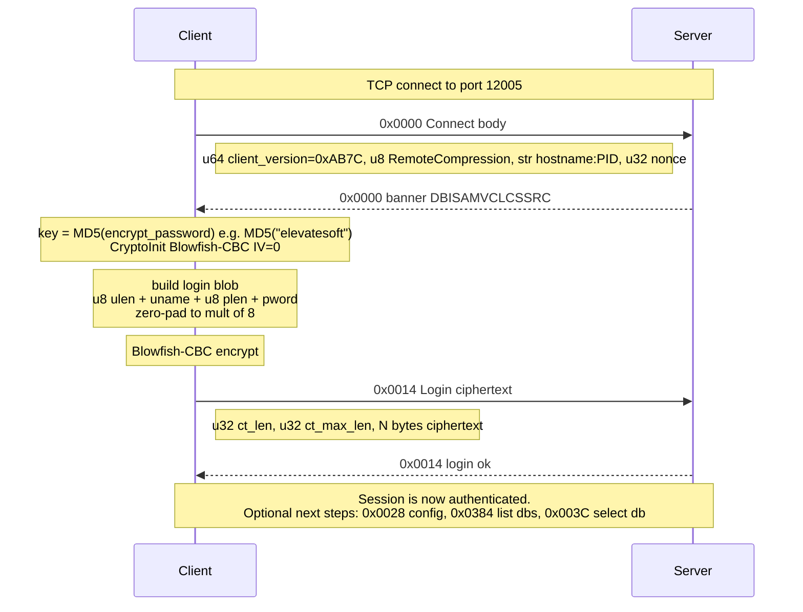
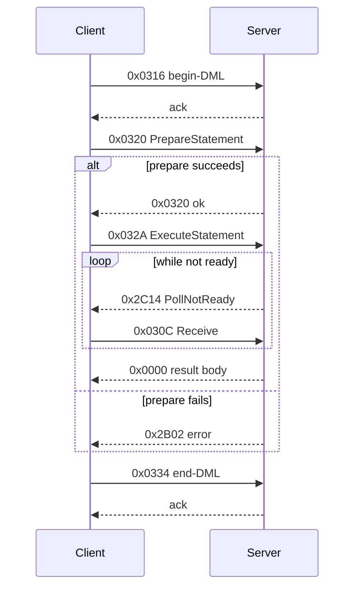

# DBISAM Client/Server Wire Protocol — Reverse Engineering Notes

Working notes on the DBISAM (Elevate Software) client/server TCP protocol,
captured from `dbsys.exe` ↔ `dbsrvr.exe` on the same Windows host via the
Npcap loopback adapter on 2026-05-25.

**Status legend:** ✅ confirmed by ≥2 examples · 🟡 single-example guess · ❓ unknown

---

## 1. Environment

- Server: `dbsrvr.exe` listening on `0.0.0.0:12005` and `0.0.0.0:12006`
- Reference client: `dbsys.exe` at `D:\ex3win\progs\dbsys.exe`
- Both on Windows host 192.168.102.240 — same-host traffic flows over
  Npcap's loopback adapter, not Ethernet.
- DBISAM/Wireshark versions: TShark 4.2.3, DBISAM unknown (probably 4.x — both
  ports listened on and `DBISAMVCLCSSRC` server-banner suggest VCL Client/Server)

### Capturing

```powershell
& "C:\Program Files\Wireshark\tshark.exe" `
    -i 5 `
    -f "tcp portrange 12000-12010" `
    -w capture.pcapng
```

- Interface `5` is the Npcap loopback adapter (verify with `tshark -D`).
- Capture the **port range**, not just 12005 — `dbsrvr` may use 12006 too,
  and filtering too narrowly produces incomplete captures.
- Non-elevated PowerShell is sufficient on this box.

### Sample captures

| File | Notes |
|---|---|
| `dbisam-capture.pcapng`   | Port 12005 only — **incomplete**, kept as a counter-example. |
| `dbisam-capture-2.pcapng` | Full login + two `count(*)` queries. Stream 1 is the interesting one. |

---

## 2. Packet framing

### Loopback prefix ✅

Every TCP segment on the loopback adapter begins with the fixed 16-byte sequence:

```
8a be 8e 59 23 64 cb 40 3d 71 d2 e3 bc 64 d0 01
```

Best guess: an Npcap loopback-adapter artifact (pseudo-Ethernet wrapper), not
part of the DBISAM protocol itself. Needs verifying against a real TCP capture
between two hosts before being treated as protocol.

### Message header ✅

After the loopback prefix:

```
+0   4 bytes   uint32 LE   message body length
+4   N bytes               message body
```

The length covers the body only, not itself or the loopback prefix.

### Inner structure ✅

Message bodies are a stream of **length-prefixed Pack units** —
every value on the wire is `<u32 LE length> <length bytes of data>`,
with no per-field type tag. The semantic of each unit depends on
position within the message, not any in-band marker. See §6c
("Universal `<u32 length> <data>` rule") for the full statement and the
disassembly source (`TDataSession.Unpack`). The "duplicate length"
appearance in earlier captures is two consecutive Pack calls — one
packing the value of an integer, the next packing the bytes whose
length equals that integer.

---

## 3. Value encodings

### Integers ✅

Integer values transmitted in messages are encoded as a **4-byte big-endian
unsigned integer with the high bit of the first byte set as a flag**. Strip
the high bit (`AND 0x7FFFFFFF`) to recover the value.

| Source | Value | Hex | On the wire |
|---|---:|---|---|
| `select count(*) from analysis` | 4,238,476 | `0x0040AC8C` | `80 40 AC 8C` |
| `select count(*) from product`  |   146,728 | `0x00023D28` | `80 02 3D 28` |

The encoded value repeats many times (9–18×) per response — likely because the
total row count is echoed in cursor metadata on every fetch round-trip.

> Open: is `0x80` a type tag meaning "uint32 follows" (in which case other tag
> bytes encode other types), or is the high bit purely a value flag (e.g.
> "non-null positive")? Single integer field type observed so far.

### ASCII strings ✅

Length-prefixed, plaintext. Example — the SQL `select count(*) from product\r\n`
(30 bytes) appears as:

```
1e 00 00 00       length (30 LE)
1e 00 00 00       max length (30 LE)    — possibly column buffer width
73 65 6c 65 63 74 20 63 6f 75 6e 74 28 2a 29 20 66 72 6f 6d 20 70 72 6f 64 75 63 74 0d 0a
```

The double-length prefix is consistent with Delphi `TStringField` serialization
(declared size + actual size).

### Timestamps ✅

8-byte little-endian IEEE 754 doubles in Delphi `TDateTime` format —
days since 1899-12-30 in the integer part, fractional day (time of day)
in the fraction. This is the standard Delphi date/time encoding;
verified against every capture containing a date/timestamp field.

```
30 3e 7a ca eb 8a e6 40   ≈  2026-05-25 (decode: as double ≈ 46,138)
```

### Opaque recurring values ✅

The length-prefixed string `"19880"` (`05 00 00 00 31 39 38 38 30`) that
appears in many server responses is the **server-assigned name of a
temp table** holding the materialised result set of a SELECT query
(see §8 closed items). It's the cursor's `TableName` field
(`cursor[+0x14]`), packed by `PackResultSetInfo` and observed
incrementing per query (19880 → 19882 → 19883 …).

---

## 4. Session / login flow

### Handshake ✅

First exchange after TCP connect is the **Connect** + **Login**
handshake — both fully decoded:

- Connect (reqcode `0x0000`) — see §6g for the 4-field body layout
  (client version, RemoteCompression flag, hostname:PID, nonce). Server
  replies with the banner `DBISAMVCLCSSRC`.
- Login (reqcode `0x0014`) — see §5 for the full Blowfish-CBC scheme
  with worked example.

### Query/result flow ✅ (superseded by §6, §7)

The narrative below is the early-capture summary from before the SQL
DML wrapper (§7) and the cursor sub-protocol (§6) were fully decoded.
**For implementation, use §7 (Prepare → Execute → Reset wrapper) and
§6 (cursor fetch) directly** — they cover the same ground precisely.
Kept here for historical/orienting context only.

For `select count(*) from <table>`, the pattern is roughly:

1. C→S: short prep packet (single byte type flag — saw `0x21` "(") on `analysis`)
2. C→S: query body (`02 00 …`, length-prefixed SQL, terminator nulls)
3. S→C: large (~4 KB) initial response — result-set schema/metadata,
   mostly zero-padded. Contains:
   - Column name (`Count Of *` for unaliased count)
   - Base column reference (`<table>.<field>` — e.g. `analysis.SASOURCE`)
   - Index name used to satisfy the query (e.g. `NISAINT_CS`)
   - The row count (encoded per §3)
   - System "Sys Text" memo field reference
4. C→S / S→C: several short round-trips that look like cursor scroll / fetch
   ("give me next block" → fixed-size block response).

The heavy zero-padding strongly suggests records are transmitted in their
on-disk **fixed-width layout** — every `VARCHAR` field padded to its declared
maximum width. This is the most plausible reason the native protocol beats
the ODBC driver: it ships rows in batched blocks even though each row is
bloated.

### Schema response for `SELECT *` ✅

For `select * from product top 5` against the `product` table (**163 columns**),
the S→C payload is 161,224 bytes. The schema region runs from offset 1,327 to
127,163 (exactly 163 × 772-byte blocks, no gaps). Row data follows after some
intermediate framing not yet decoded.

### Column schema block layout (772 bytes per block) ✅

For each column, one 772-byte block. The fixed positions within a block are:

```
+0x000  03 00 00                          fixed marker
+0x003  <ord:u16 LE>                      column ordinal (1-based)
+0x005  <namelen:u8>                      length of column name
+0x006  <name bytes>                      ASCII column name (varies)
+0x006+namelen .. 0x0A6                   nulls (and likely leftover memory — see note)
+0x0A7  <12 bytes column descriptor>      see below
+0x0B3 .. end-of-block                    qualified name ("<table>.<col>"),
                                          index name, more padding
```

Note: the name field appears to be a Delphi `ShortString` buffer (1-byte length
+ up to 255 chars). DBISAM doesn't zero the buffer between writes, so bytes
past `namelen` can contain stale data. **Trust the length byte, not visible
ASCII runs.**

### Column descriptor (12 bytes at +0xA7) ✅

Confirmed format across all 163 product columns:

```
+0  <sub:u8>           Delphi-style TFieldType code (see table below)
+1  00
+2  <decl:u8>          declared size (string length for ftString; 0 for fixed-size types)
+3  00 00
+5  <max:u8>           on-disk storage width
+6  00 00
+8  <row_offset:u16 LE>  byte offset of this field within the *on-disk* record
+10 00 00
```

Observed `sub` values (all confirmed against multiple columns):

| sub | Likely TFieldType | Storage (`max`) | Examples |
|----:|---|---:|---|
| `1` | `ftString`   | `decl + 1`  | `CODE`(30), `COMMOD`(18), all UF_* |
| `3` | `ftBlob`/`ftMemo` (handle) | `8`  | `LONGDESC` |
| `4` | `ftWord` / `ftSmallint` | `2`  | `PACKCONV`, `PACKULOAD` |
| `7` | `ftCurrency` | `8`  | `PRICE`, `PRICEPER`, `STDCOST`, `MASSNET` |

The `row_offset` field is provably the **on-disk record offset**: consecutive
columns' offsets differ by exactly `prev.max + 1` (the `+1` is the per-field
null-indicator byte). E.g. `CODE.offset=25, max=31` → `COMMOD.offset=57 = 25+32`.

### Row layout ✅ (confirmed via disassembly of `TDataCursor.CalcRecordHash`)

Each row on the wire = `[pre-record framing] [record]`. The record itself is a
flat dump of the on-disk fixed-width record.

**Record structure:**

```
+0    9 bytes    header (8-byte LE TDateTime at +1..+8, byte +0 = type/flag)
+9    16 bytes   MD5 hash of record[25..end]
+25   N bytes    field data, fields walked using schema's row_offset / max
```

**Per-field on-disk format** (matching schema's `row_offset` exactly):

```
+0    1 byte     null-indicator: 0x00 = NULL, 0x01 = not null
+1    max bytes  value data, format depends on sub-type:
                 - sub=1 (ftString)   : ASCII chars, NULL-padded to fill (decl bytes used + padding)
                 - sub=3 (ftBlob/Memo): 8-byte blob handle
                 - sub=4 (ftWord)     : 2 bytes
                 - sub=7 (ftCurrency) : 8 bytes (Int64 scaled by 10000)
```

Consecutive fields are at `row_offset` + (max + 1), i.e. fields are packed back
to back with the null-flag byte serving as the separator.

**Verified against row 3 (`*ARCOFO`) from `select * from product top 5`:**

| Field | row_offset | Bytes observed | Decoded |
|---|---:|---|---|
| (hash) | +9..+24 | `D9 4E 91 99 DE 70 C4 09 1D A9 09 A6 4B 6E 63 52` | MD5 of record[25..end] |
| CODE   | +25      | `01 2A 41 52 43 4F 46 4F 00…` | not-null, `"*ARCOFO"` |
| COMMOD | +57      | `00 …`                         | NULL |
| GROUP  | +77      | `00 …`                         | NULL |
| DESC1  | +87      | `01 41 72 61 62 69 63 20…`     | not-null, `"Arabic Certificate of Origin"` |

### Pre-record framing ✅

The "~76 bytes between records" observed in early captures is the
**bookmark array**, not per-record framing. It carries the primary-key
of each row (`01 *ARCOFO\0…` is CODE — the PK — inside a bookmark, not
inside the record). Records and bookmarks are sent as separate length-
prefixed Pack units, not interleaved; the bookmark length is
`GetBookmarkSize()` (see §6d for the per-cursor-type sizes — 17 for
single-PK, 21 for composite PK, 47 for ORDER BY, 5 for unindexed JOIN).
For typical wide-key tables the bookmark size lands near 76 bytes,
which is what produced the original impression of "framing between
records".

### Cursor preamble ("28 KB blob") ✅

Confirmed via disassembly of `TDataCursor.UnpackCursorInfo`
(RVA 0x086D84): the previously-mysterious large block between schema
end and first row data is **the packed `CursorInfo` state**, which the
client unpacks into the `TDataCursor` instance at the following offsets
(in order):

| # | Cursor offset | Notes |
|---|---|---|
| 1 | `+0x68`   | small struct |
| 2 | `+0x278`  | large struct (page/buffer state) |
| 3 | `+0x4684` | **very large struct** (~18 KB into the object — the cursor's read-ahead buffer cache, accounting for most of the 28 KB) |
| 4 | (variable) | `UnpackVariableTableInfo` — field defs + locale charsets |
| 5 | `+0x3679` | byte flag |
| 6 | `+0x60E`  | byte (EOF flag — `PopulateRecordBlockForward` checks this) |
| 7 | `+0x60D`  | byte (BOF flag) |

The bulk of the size is the read-ahead buffer at `+0x4684`. Wire form
is just the standard `<u32 length><data>` per field; no special
treatment needed once you skip past it to reach the row block (see
§6h).

### Sample of confirmed `product` column names (first 30)

```
CODE COMMOD GROUP DESC1 DESC2 DESC3 DESC4 DESC5 LONGDESC PRICE
PUNIT PRICEPER CUNIT CUNITFAC QUNIT STDCOST STDCOSTPER PACKCONV PACKULOAD PACKCOST
PACKCOSTPER MASSNET MASSGROSS MASSPACKED MASSPER VOL VOLPACKED VOLPER VATRATE EXTRA
```

(Earlier names with trailing `D`/`R`/`NTATE` were extraction artifacts —
the actual names are clean and end at the length-prefixed boundary.)

---

## 5. Login handshake ✅

Decoded via disassembly of the BPL (`TDataSession.Login`, `TDataSession.Connect`)
and a known-plaintext check against the captured login bytes. Verified by
encrypting our user/password with the recovered key and matching all 24
ciphertext bytes exactly.



### Algorithm

- **Cipher:** Blowfish-CBC
- **IV:** 8 zero bytes
- **Key:** `MD5(encrypt_password)` — a 16-byte digest

The encrypt password comes from `TDBISAMSession.RemoteEncryptionPassword` and is
typically baked into the client app's DFM as a property. For `ex3win` /
`dbsys.exe`, it is the literal string **`elevatesoft`** (found in the embedded
DFM as `RemoteEncryptionPassword..elevatesoft`).

In the BPL: `TDataSession.SetEncryptPassword` stores this string at instance
field `+0x5c`. On `TDataSession.Connect`, `MD5String(field_0x5c)` is computed
into `field_0x60`, then `TDataEngine.CryptoInit(engine, key=field_0x60,
keylen=16, @ctx=field_0x70, @ctxsize=field_0x74)` initializes a
`TBlowfishData` context at `field_0x70`.

### Plaintext

```
+0    u8       username length    (capped at 255)
+1    N bytes  username
+1+N  u8       password length
+2+N  M bytes  password
+...  pad      zero bytes, to multiple of 8 bytes (Blowfish block size)
```

### Wire format

Message has request code `0x14` (`SetRequestCode(0x14)`). After the standard
message header, two length-prefix u32s frame the ciphertext (Delphi's two-step
`Pack(len, 4)` then `Pack(data, len)` writes `<actual_len:u32><max_len:u32>`):

```
... req=0x14 ...
<u32 LE ct_len>          ; ciphertext length
<u32 LE ct_max_len>      ; max-length = ct_len
<N bytes>                ; ciphertext (multiple of 8)
```

### Worked example

For `e3user` / `e3usernew` with encrypt password `elevatesoft`:

```
plaintext (17 → padded 24)
  06 65 33 75 73 65 72 09  65 33 75 73 65 72 6E 65
  77 00 00 00 00 00 00 00

key = MD5("elevatesoft")
  CE 85 01 AA C5 39 B4 BD  4C 54 32 7E 41 D9 75 B0

ciphertext (Blowfish-CBC, IV = 0)
  57 25 56 8E 56 01 B0 58  D1 7E E1 77 20 B6 95 24
  78 1F 5A 02 17 F2 43 90
```

Matches captured bytes exactly.

### Notes / overrides

DBISAM exposes `TDBISAMEngine.OnEncryptBlock` as a published event for apps
that want to override the encryption with a custom algorithm. In the BPL,
`TDataEngine.EncryptBlock` first checks `[self+0x1178]` (block-encrypt
callback) and `[self+0x1170]` (init callback); if set, calls those instead of
the default `BFInit`/`BFEncrypt` path. **`dbsys.exe` does NOT register either
callback** — verified by scanning the binary for writes to those offsets and
finding none. So the default Blowfish-CBC path is what's actually used.

---

## 6. Cursor fetch sub-protocol ✅

For multi-row SELECT queries the server returns row data in several
`(client-fetch, server-batch)` round-trips after the schema response.
The reqcodes used by dbsys's grid widget were originally classified
empirically; all now have method names from disassembly of the BPL.

| Reqcode | Method | Purpose |
|---:|---|---|
| `0x032A` | `TQueryStatement.ExecuteStatement` (§7c) | run prepared statement (sets up the result cursor) |
| `0x030C` | `TDataCursor.Receive` / `TDataSession.Receive` / `TQueryStatement.Receive` | poll for response continuation (used by any long-running operation) |
| `0x00BE` | `TDataCursor.SetToBegin` | reset cursor position to start of result |
| `0x00FA` | `TDataCursor.GetNextRecord` | advance by **one** record |
| `0x0104` | `TDataCursor.GetPriorRecord` | go back by **one** record |
| `0x0154` | `TDataCursor.SetToBookmark` | seek to a saved bookmark position |

The previously-mysterious alternation of `0x00FA`/`0x0104`/`0x0154`
in captures was simply dbsys's grid widget doing single-row navigation
plus occasional bookmark re-positioning as the user scrolled. **For
bulk extraction, use the batch reqcodes from §6h instead** (`0x050A`
`ReadFirstRecordBlock` + `0x04F6` `ReadNextRecordBlock`) — they fetch
N records at a time rather than one per round-trip.

**Fetch body layout (60-byte form, used for `0x00FA`/`0x0104`/`0x0154`):**

```
00 <reqcode:u16 LE> <inner_len:u32 LE>          7-byte header
04 00 00 00  01 00 00 00                        cursor handle / version
11 00 00 00                                     length 17 (16-byte key slot)
01 <key bytes up to 16, null-padded>            null-flag + primary-key
01 80 00 00 <u8 row_idx>                        row index in result set
01 00 00 00  00 01 00 00 00                     state flags
00 04 00 00 00 <u8 status> 00 00 00             cursor status
```

The 16-byte key slot is the **bookmark** (see §6d) — for natural-PK
cursors it's the primary key; for other cursor types the slot size
varies, see the table below.

**Cursor navigation modes** (verified across four captures: natural-PK,
indexed JOIN, ORDER BY, unindexed JOIN).

Every fetch body has the same outer layout:

```
00 <reqcode:u16> <inner_len:u32>     header
04 00 00 00 01 00 00 00              cursor handle (8 bytes, stable)
<slot_length:u32>                    slot length — tells you the mode
<slot_content: slot_length bytes>    slot content — opaque
01 80 00 00 <row_idx:u8>             row position
01 00 00 00 00  01 00 00 00 00       state flags
04 00 00 00 <status:u8> 00 00 00     status / trailing
```

The `<slot_length, slot_content, row_idx, state>` block appears verbatim in
both the server's response and the client's next fetch. The slot mode varies:

| Mode | `slot_length` | Slot content | When used |
|---|---:|---|---|
| **Natural single-table** | 17 | null-flag + 16-byte primary key | `SELECT … FROM t [WHERE …]` against an indexed table |
| **JOIN (indexed)** | 17 | null-flag + 16-byte key of *leading* indexed column | JOIN whose driving table has a usable index for the join condition |
| **ORDER BY / aggregate** | 47 | 47 zero bytes (server-managed) | `ORDER BY <non-pk>`, `GROUP BY`, distinct, sort-required plans. Preceded by ~18 `0x030C` "sort progress" polls. |
| **JOIN (unindexed)** | 5 | empty (just the row_idx that follows) | JOIN where neither side has an index on the join column |

Verified examples:

- `select * from orderh left join orderi on orderh.ref = orderi.ref top 11`
  → indexed JOIN, slot carries `orderh.ref` value `01 32 30 35 32 38 30 …`
- `select saproduct, ohinvref from analysis left join orderh on analysis.sainv = orderh.ohinvref top 5`
  → unindexed JOIN, slot_length=5, no key, server iterates by row counter
- `select … from CUSTOMER ORDER BY CPYNAME TOP 3`
  → materialized, slot_length=47, ~18 polls before the first fetch
- `select code, cpyname, contact, email from CUSTOMER TOP N`
  → natural-PK, slot_length=17, carries the customer CODE

**The universal cursor-advance rule:** parse each server response to locate
the cursor handle, read `slot_length`, and copy the entire `<slot_length +
slot_content + row_idx + state>` block into the next fetch message
verbatim. No interpretation of the slot content needed.

**Implementation status:** PoC handles natural-PK and indexed-JOIN (key
extraction + splice). The universal copy-paste rule is documented but not
yet implemented in the Python client — that's a proper rewrite worth taking
time over for the production client in whatever language replaces this PoC.

---

## 6a. Memo / blob fetch ✅

Memo and blob columns (sub-type `3`, `max_size = 8`) carry only an 8-byte
**handle** in the row data. The handle is opaque to the client; the actual
content is fetched in a separate round-trip when the application reads the
field.

**Two reqcodes:**

| Reqcode | Direction | Purpose |
|---|---|---|
| `0x0280` | C → S then S → C | open/read blob — returns the content inline |
| `0x028A` | C → S then S → C | close blob — short ACK |

**Request layout (`0x0280`, 100 bytes for a 14-char primary key):**

```
00 80 02              header + reqcode
<u32 inner_len>       e.g. 0x59 = 89
04 00 00 00 01 00 00 00     cursor handle
<u32 col_ordinal>     column index of the blob (1-based)
<u32 col_ordinal>     same value, twice
02 00                 ?
<u32 slot_length>     56 in the observed case
<… slot_content …>:
  16-byte row MD5 hash (the same hash stored at row offset +9..+24)
  01 + primary key bytes (length-prefix + value) padded to fill slot
```

**Response (`0x0280` reply):** standard message framing, then somewhere
in the body the blob payload appears as Delphi-style length-prefixed:

```
<u32 actual_len>      e.g. 0x118 = 280
<u32 max_len>         same as actual_len for small blobs
<blob bytes>          the actual memo / blob content
```

The blob is returned inline. For small memos (a few hundred bytes) this is
one round-trip. Whether larger blobs are paginated has not been verified.

**Verified example:** for the row with `NIEAN = "00715677478441"`, sending
the blob open request returned a 280-byte payload of ingredient text
starting with bytes `53 75 67 61 72 2c 20 67 6c 75 63 6f 73 65 …` —
which is "Sugar, glucose…" in ASCII. The text happened to be pure ASCII
in this row; longer/non-English content would be encoded in the table's
configured 8-bit codepage (DBISAM 4 predates UTF-8 — that's an ElevateDB
addition). Earlier customer captures showed garbled bytes for non-ASCII
chars (e.g. the Polish ł in "Spółka"), confirming the data is 8-bit
codepage encoded, not UTF-8.

**Locale / codepage decoding rule** (from disassembly of
`LocalUnpackVariableTableInfo` at RVA 0x086BB4 and `TDataCursor.GetLocaleID`
at RVA 0x088EF8): the wire does *not* carry a codepage identifier per
string. What the cursor preamble *does* carry — packed by
`VariableTableInfo` — is two `set of AnsiChar` bitmaps (32 bytes each,
serialised via `CharSetToString`) describing the locale's
upper/lowercase character ranges. These are for the server's
locale-aware sorting/filtering, not for the client to decode strings.

String fields therefore come over as **raw ANSI bytes in the server's
configured locale**, with no per-string codepage tag. To decode:

1. Query the cursor's locale via `TDataCursor.GetLocaleID` (or use the
   table's default via `TDataTable.GetLocaleID`) — these are exposed as
   numeric `LocaleID` values (Windows LCID-style).
2. Map the LocaleID to a codepage on the client side. For ex3win and
   most Western installs that's `Windows-1252` (LCID `0x0409` /
   `English_United_States.1252`).
3. Use that codepage to decode the bytes to UTF-8 in the client.

For the SELECT-only extractor against ex3win specifically:
**`Windows-1252` (codepage 1252)** is the safe default — it handles all
the Western European characters seen in customer captures (including
the Polish ł in "Spółka" — which encodes as `0xB3` in CP1250 / `0xB3`
in CP1252 depending on the install's regional setting). If a deploy
uses a non-Western LocaleID, the mapping needs to switch accordingly
(CP1250 for Central European, CP1251 for Cyrillic, etc.).

The Rust port can either hardcode CP1252 (simplest, works for ex3win),
read the cursor's LocaleID and select a codepage via a small lookup
table (more robust), or just store the raw bytes and let downstream
consumers decode (most flexible).

**Implementation note for the production client:** the row's MD5 hash is
already in hand from parsing the row (bytes 9..24 of the record). The
primary key (CODE-style field) is the first field of the row. So no extra
state needs to be tracked — for each row, if a column's sub_type is 3 and
the handle is non-zero, send a `0x0280` with (cursor_handle, col_ordinal,
row_hash, primary_key) and read the blob from the response.

---

## 6b. Field type codes (`sub` byte in column descriptor) ✅

Observed across all captures:

| `sub` | `max` | DBISAM type | Wire decode |
|---:|---:|---|---|
| `0` | `0` | calculated/derived | no storage |
| `1` | `decl+1` | ftString | length-prefixed ASCII, null-padded to `decl` |
| `2` | `4` | ftDate | **4-byte LE u32 = days since `0001-01-01` (proleptic Gregorian)** |
| `3` | `8` | ftBlob/Memo | 8-byte handle → separate blob fetch (§6a). Blob subtype byte at column-block offset `+0xA8`: `0x00` = ftBlob (binary), `0x16` = ftMemo (text — apply column-level encoding when decoding the fetched bytes). |
| `4` | `2` | ftBoolean | 2-byte LE WordBool: `FF FF` (-1) = TRUE, `00 00` = FALSE. (DBISAM's enum, *not* Delphi standard which puts ftWord at 4.) |
| `5` | `2` | ftSmallint | 2-byte LE signed int (range -32,768 .. 32,767) — was previously mis-identified as ftBoolean based on observed values, but a SMALLINT test column also maps here. ftBoolean's actual sub code TBD. |
| `6` | `4` | ftInteger / ftAutoInc | 4-byte LE int; subtype byte at column-block `+0xA8`: `0x00` = ftInteger, `0x1D` = ftAutoInc |
| `7` | `8` | ftCurrency / ftFloat | both 8 bytes; subtype byte at column-block `+0x250`: `0x0A` = ftCurrency (Int64 LE / 10,000), `0x00` = ftFloat (8-byte LE binary64 / IEEE 754 double) |
| `9` | `N` | ftBytes | N raw bytes (fixed-length binary) |
| `10` | `4` | ftTime | 4-byte LE u32 = milliseconds since midnight |
| `15` | `N` | ftVarBytes | up to N bytes (variable-length binary; length prefix used) |
| `18` | `8` | ftLargeint | 8-byte LE signed int (Int64) |
| `11` | `8` | **ftDateTime** | 8-byte LE binary64 double = days since `1899-12-30` (Delphi TDateTime — fractional part is time-of-day) |

**Type refinement bytes** within each 772-byte column block (in addition to `sub`):

- `+0x0A8` distinguishes within sub=3 (blob family) and within sub=6 (int family):
    - `+0xA8 = 0x00` (sub=3) = ftBlob (binary, raw bytes)
    - `+0xA8 = 0x16` (sub=3) = ftMemo (text — apply column encoding map)
    - `+0xA8 = 0x1A` (sub=3) = ftGraphic (image bytes)
    - `+0xA8 = 0x00` (sub=6) = ftInteger
    - `+0xA8 = 0x1D` (sub=6) = ftAutoInc
- `+0x250` distinguishes within sub=7 (8-byte numeric family):
    - `+0x250 = 0x00` = ftFloat
    - `+0x250 = 0x0A` = ftCurrency

Verified with a purpose-built `testtypes` table containing one column of each candidate type (AUTOINC, SMALLINT, LARGEINT, FLOAT, TIME, TIMESTAMP, BYTES, VARBYTES, GRAPHIC) and INSERTs with recognizable known values (1234, 9876543210, π, "DEADBEEF", 12:34:56 etc) — every value found at the predicted byte position after schema decode.

**Date encoding gotcha:** Despite Delphi's standard `TDateTime` epoch being `1899-12-30`, DBISAM 4 stores `ftDate` as days since **`0001-01-01`** (proleptic Gregorian — same as .NET's `DateTime`). To convert:

```python
days = int.from_bytes(field_bytes, "little")
value = date(1, 1, 1) + timedelta(days=days)
# or to Delphi convention:
delphi_days = days - 693594
```

Verified with `select distinct sadate from analysis where sadate > '2025-01-01' top 10` returning dates 2025-01-02 through 2025-01-15. Each date matched the formula exactly (e.g. 2025-01-02 = 739,253 days = bytes `B5 47 0B 00` LE).

Not yet observed: `ftFloat` (likely 8-byte LE binary64), `ftTime`, `ftLargeint` (8-byte int), `ftWideString`. These will surface naturally when a query touches such a column.

**Note on the two date types:** DBISAM distinguishes `ftDate` (date-only, 4-byte int, custom 0001-01-01 epoch) from `ftDateTime` (date + time-of-day, 8-byte double, Delphi 1899-12-30 epoch). The 8-byte ftDateTime is also the format used internally in row-headers for modification timestamps (row bytes +1..+8).

---

## 6d. Cursor info: 10-field schema including the bookmark ✅

Derived from disassembling `TServerThread.PackCursorInfo` (RVA 0x49810).
After a query, the server packs cursor state as 10 sequential length-prefixed
units (in order):

| # | Field | Size | Notes |
|---|---|---:|---|
| 1 | `RecordNumber` | 4 | current row's record number in the cursor |
| 2 | `PhysicalRecordNumber` | 4 | physical record # on disk |
| 3 | `RecordCount` | 4 | total rows in cursor |
| 4 | `PhysicalRecordsUsed` | 4 | used slots in underlying table |
| 5 | `LastAutoIncID` | 4 | last auto-inc value |
| 6 | `LastUpdated` | 8 | TDateTime double — last mtime |
| 7 | `TotalRecordCount` | 4 | grand total across cursor + subindexes |
| 8 | **`Bookmark`** | variable | **THE OPAQUE CURSOR POSITION** — produced by `TDataCursor.GetBookmark`, size from `GetBookmarkSize` |
| 9 | byte at `+0x60E` | 1 | flag |
| 10 | byte at `+0x60D` | 1 | flag |

### The bookmark is the answer to "how do I advance the cursor"

The "cursor slot" we observed empirically across four cursor modes IS the
bookmark. Different cursor types have different bookmark sizes:

| Cursor type | Observed bookmark size | Composition |
|---|---:|---|
| Natural single-PK | 17 bytes | null-flag + 16-byte primary key |
| Indexed JOIN | 17 bytes | null-flag + 16-byte leading-table PK |
| Composite PK (e.g. ARCVCFG) | 21 bytes | null + key1 (max+1) + null + key2 (max+1) + row_idx |
| ORDER BY / materialised | 47 bytes | empty 47-byte slot — server-managed position |
| Unindexed JOIN | 5 bytes | row_idx only |

The CLIENT does not need to know the bookmark's internal format. **Universal
cursor-advance rule:** after each server response, parse out the cursor-info
units in order, the 8th is the bookmark — echo those bytes verbatim into the
next fetch request's bookmark slot. Works for every cursor mode.

This is why DBISAM exposes `TDataCursor.GetBookmark` as a public API — the
client uses it for navigation without interpreting the contents.

---

## 6e. Field definition wire format ✅

Derived from disassembling `TDataCursor.UnpackResultSetFields` (RVA 0x86E78)
and `TServerThread.PackResultSetFields` (RVA 0x49998):

```
<u16 LE field_count>                        — one Pack call, length=2
for each field:
    <u32 LE 768><768-byte TFieldDefinition>  — one Pack call, length=0x300
    if field has expression (calc field):
        <u32 LE 4><i32 token_count>          — expression token count
        <u32 LE token_bytes><tokens>         — packed expression tokens
```

The empirical 772-byte stride we observed = 4-byte length prefix + 768-byte
`TFieldDefinition` payload. The schema offsets within the 768-byte payload:

| Offset (within payload) | Field | Notes |
|---:|---|---|
| `+0x00` | ord (u16 LE) | column ordinal, 1-based |
| `+0x02` | namelen (u8) | name length |
| `+0x03..` | name (60 bytes) | column name, null-padded |
| `+0x3F..` | qualified name (100 bytes) | `<table>.<column>` |
| `+0xA4` | sub-type (u8) | DBISAM field type code |
| `+0xA5` | padding (u8) | **unused** — BPL-wide scan found zero instructions reading or writing this byte; alignment filler between the +0xA4 sub-type and the +0xA6 word |
| `+0xA6` | legacy version field (u16) | touched only by `TDataCursor.UpgradeTable` (the old→new on-disk format migration code); the live engine never reads it. Safe to ignore in a forward-only client |
| `+0xA8` | type-refinement (u8) | discriminates blob subtype, AutoInc-vs-Int, etc. (see §6b) |
| `+0xA9` | declared size (u16) | |
| `+0xAB` | (u8) | |
| `+0xAC` | row_offset (u16) | offset of this field within an on-disk record |
| `+0xAE..` | various 100-byte name slots | index name, etc. |
| `+0x1E0` | is-expression flag (u8) | if non-zero, expression tokens follow this struct |
| `+0x1E5` | encrypted-field flag (u8) | |

(Adjust by +4 if working from the start of the 772-byte length-prefixed
block; the offsets above are within the 768-byte payload.)

---

## 6f. Cursor-response result code (end-of-cursor signal) ✅

The first Pack unit in any cursor-response body is a **2-byte result code**:

| Value | Meaning |
|---:|---|
| `0x0000` | OK — cursor has rows; continue reading row records that follow |
| `0x2202` (8706) | **End-of-cursor / empty result** — no rows to follow |

Verified by capturing a `WHERE clause_that_matches_nothing` query and diffing
the first fetch response against a normal multi-row response: every byte
differed but the result-code value `02 22` (vs `00 00` in the non-empty case)
was the only field whose semantic clearly indicated the empty-cursor state.

Cursor-response body layout:

```
3-byte header                       <flag:u8=0> <reqcode:u16 LE>
4-byte body length                  <u32 LE — bytes from this point>
Pack stream:
    <u16 LE result code>            0x0000 = OK, 0x2202 = end-of-cursor
    PackCursorInfo's 10 fields      (RecordNumber, ..., Bookmark, flags)
    [row records]                   only if result_code == 0; each row is
                                    one Pack call with length=record_size
```

**Production client rule:** check the result code immediately after reading
the body header. If non-zero, the cursor is exhausted — close cleanly without
heuristic plateau detection.

---

## 6c. Wire framing: universal `<u32 length> <data>` rule ✅

**The single most important framing fact** — derived from disassembling
`TDataSession.Unpack` (RVA 0x07752C, the workhorse for reading the wire):

```
unpack(dest):
    length = u32 LE at current buffer position
    advance 4
    Move(buffer + pos, dest, length)
    advance length
    return length
```

Every piece of data on the wire — without exception — is structured as:

```
<u32 LE length> <length bytes of payload>
```

Both PACK (server-side write) and UNPACK (client-side read) follow this rule.
Higher-level structures are sequences of these units; their semantic meaning
depends on the message type and order, but the FRAMING is uniform.

### Row records on the wire

A row record in a cursor response is **one Pack call** with
`length = record_size`, where:

```
record_size = last_col.row_offset + last_col.max + 1
```

So in any server response we can deterministically locate each row record by
walking the length-prefixed units and matching the expected `record_size`.

Verified by inspection of an ARCVCFG cursor response (`record_size = 56`):

```
... cursor metadata (various length-prefixed units) ...
38 00 00 00     ← u32 LE = 56 (record length)
<56 bytes>      ← the on-disk record: 25-byte header + fields at schema offsets
```

For customer (record_size = 168), the prefix bytes are `A8 00 00 00`. For any
table, compute `record_size` from the schema and search for it as the
length-prefix preceding each row.

### Implication for PoC / production client

Earlier the PoC used pattern-matching (find positions where all column null
flags look valid) + dedup to identify rows. That was a heuristic that worked
for customer (each row uniquely identified by CODE) and failed for ARCVCFG
(composite key, leading column shared). With the universal framing rule, the
correct row-walker is:

1. Locate the row-data section in the server response (after schema + cursor
   init metadata).
2. Read `u32 length` — if equal to `record_size`, read `record_size` bytes as
   one row record; otherwise it's some other cursor-info unit, skip it.
3. Decode fields from the row record using schema offsets.
4. Repeat until we hit a length that doesn't match `record_size`.

No deduplication, no pattern guessing. The framing is deterministic.

---

## 6h. Table-cursor read methods (TDataCursor path) ✅

Recovered from disassembling `TDataCursor.ReadFirstRecordBlock`
(RVA 0x0A06F4), `TDataCursor.ReadNextRecordBlock` (RVA 0x0A0840),
`TDataCursor.OpenCursor` (RVA 0x087164), and `TDataCursor.CloseCursor`
(RVA 0x087EC8). These are the **base TDataCursor** read primitives —
used when the client opens a table directly (or, internally, when
walking the server-side SELECT temp table; see §7k cursor-pin notes).

| Reqcode | Method | Body shape |
|---:|---|---|
| `0x0096` | `OpenCursor` | open the cursor on a (table, index) |
| `0x00A0` | `CloseCursor` | `Pack(cursor_handle, 4)` |
| `0x0208` | `DeleteTable` (direct DROP) | `Pack(cursor_handle, 4)` + `PackString(table_name)` — non-SQL DROP primitive; subject to the same `UseCount > 0 → 0x2B05` rejection (see §7f) |
| `0x050A` | `ReadFirstRecordBlock` | `Pack(cursor_handle, 4)` + `Pack(arg, 4)` |
| `0x04F6` | `ReadNextRecordBlock`  | `Pack(cursor_handle, 4)` + `Pack(arg, 4)` |
| `0x053C` | `AddRecordBlock` (INSERT) | handle + record + bookmark + per-field expansion |

### ReadFirst/Next request body

```
SetRequestCode(0x050A | 0x04F6)
Pack(cursor[+0x10], 4)              ; 4-byte cursor handle
Pack(arg, 4)                        ; 4-byte batch parameter (records to fetch /
                                    ;   starting position — caller-supplied)
```

### ReadFirst/Next response body

```
Unpack u16 status                   ; 0x0000 = OK, 0x2202 = end-of-cursor
UnpackCursorInfo                    ; the 7-field cursor preamble (see §4
                                    ;   "Cursor preamble") — updates the cursor
                                    ;   instance with new position/buffer state
Unpack(arg2_buf)                    ; bookmark array — N × GetBookmarkSize() bytes
Unpack(arg3_buf)                    ; record array   — N × cursor[+0x3672] bytes
Unpack(arg4_buf)                    ; trailing metadata (count / status)
```

Records and bookmarks are written into **parallel caller-supplied
buffers** by `PopulateRecordBlockForward` (RVA 0x0A03E4) — confirming
they're not interleaved. Each entry in `arg3_buf` is one on-disk row
(see §6c "Row records on the wire" — width = `last_col.row_offset +
last_col.max + 1`). Each entry in `arg2_buf` is one bookmark in the
same format as §6d, field #8.

### Relation to the SQL fetch path (§6)

§6 documents reqcodes `0x032A/0x030C/0x00BE/0x00FA/0x0104/0x0154`
observed on the wire from `dbsys.exe` SQL queries. Those operate
against the server-side **query** layer; the `Read*RecordBlock`
reqcodes above are the lower-level **TDataCursor** primitives that the
production extraction client will most likely use directly when
walking a remote table or a server-side temp table.

---

## 6g. Connect (handshake) message layout ✅

Decoded by parsing the captured client→server first packet using the universal
`<u32 length><data>` rule:

```
3-byte header                    flag=0x00, reqcode=0x0000
4-byte body length               u32 LE = 41
Pack stream (41 bytes, 4 fields):
    field 1: u64 = 0xAB7C        ← client version / build identifier (43,900)
    field 2: u8  = 0              ← RemoteCompression flag (off when 0)
    field 3: AnsiString            ← `<hostname><N>` where N changes per connection
                                       (observed: "RIVSEM048692", "RIVSEM049256"
                                        on host "RIVSEM04" — the 4-digit suffix
                                        is per-connection, likely the client PID)
    field 4: u32 = random          ← session nonce (`E5A21BE8` in capture)
4 trailing zero bytes            (padding)
```

**Field 2 (u8) is the RemoteCompression flag.** When the application sets
`TDBISAMSession.RemoteCompression := True` (setter at BPL RVA 0x030C98), this
byte goes to 1, and all subsequent wire traffic between client and server is
Zlib-compressed (via `Zlibpas.deflate` / `inflate`).

**Field 1 (u64 = 43,900 = 0xAB7C)** is most likely a client version or build
identifier. Not interpreted by us — server uses it for compatibility checks.
For DBISAM 4.39 this value is stable; production client should copy it as-is.

### Compression options summary

DBISAM exposes Zlib compression at four layers:

| Layer | API | Effect |
|---|---|---|
| **Wire** | `TDBISAMSession.RemoteCompression` | Client↔server traffic Zlib-deflated end-to-end |
| Page | `TPage.CompressPageData` (server) | On-disk table pages compressed transparently |
| Blob | `TBlobBuffer.Compress` | Memo / blob content compressed in storage |
| Index | `TDBISAMIndexDef` with `TIndexCompression` | Index keys compressed in the index file |

For SELECT-only extraction the relevant one is **wire compression**. Expected
benefit on DBISAM result-set traffic is significant (3-5× reduction) because:
- Schema responses have many 768-byte struct shapes with identical headers
- String fields are null-padded → repetitive zeros
- Currency / Date / numeric values often have leading zeros
- Row records repeat the same MD5-header structure

Worst case: extracting blob columns that already contain compressed content
(JPEGs, PDFs) → no benefit. Best case: schema-heavy responses (initial query
response with 100+ columns) → potentially 10× or more.

---

## 7. DML path (UPDATE / DELETE / INSERT) ✅

Decoded from four `tshark` captures against the live server using `dbsys.exe`:
a 9360-row UPDATE, a 2-row DELETE, a 1-row INSERT, and a failed INSERT
(typoed table name). All three DML operations use **byte-identical wire
framing** — only the SQL text inside `PrepareStatement` differs.



### 7a. Wire flow

```
C → S   0x0316  begin-DML marker  (body: 04 00 00 00  01 00 00 00)
S → C   0x0000  ack               (body: 04 00 00 00  01 00 00 00)

C → S   0x0320  PrepareStatement  (SQL text + trailer — see 7b)
S → C   0x0320  prepare ok        (echoes affected table name)
     or 0x2B02  prepare error     (length-prefixed offending identifier)
                                  ↑ on error, client SKIPS ExecuteStatement
                                    and goes straight to 0x0334

C → S   0x032A  ExecuteStatement  (fixed 34-byte body — see 7c)
S → C   0x0000  immediate result  (fast op — see 7d for result body)
     or 0x2C14  PollNotReady      (slow op, server is still working)

    when 0x2C14:
        loop {
            C → S   0x030C  Receive(poll)  (body: 01 00 00 00 00)
            S → C   0x2C14  PollNotReady   (body includes progress %)
                or 0x0000   result body    (when done)
        }

C → S   0x0334  end-DML marker    (body: 04 00 00 00  01 00 00 00)
S → C   0x0000  empty close ack
```

### 7b. PrepareStatement body

Decoded from disassembly of `TQueryStatement.PrepareStatement`
(RVA 0x0091F4). Each `4` is a Pack-call length prefix (per the §6c
universal `<u32 length><data>` framing), not a magic number.

```
+0   u32 LE = 4        length-prefix
+4   u32 LE            statement handle (instance field self[+0x0C];
                         server-assigned, increments per Prepare)
+8   u32 LE = 4        length-prefix for the SQL-length value
+12  u32 LE = N        SQL string length (the value)
+16  u32 LE = N        length-prefix for the SQL bytes (= N)
+20  N bytes           SQL text (ASCII, terminated with \r\n)
+20+N  u32 LE = 1      length-prefix
+24+N  u8              flag byte (instance field self[+0x58])
+25+N  u32 LE = 4      length-prefix
+29+N  i32 LE          instance field self[+0x5C] — likely MaxRows
                         (observed as -1 = 0xFFFFFFFF = unlimited)
+33+N  u32 LE = 4      length-prefix     ┐ only present when remote engine
+37+N  u32 LE          caller option #2  │ version ≥ threshold; dbsys
+41+N  u32 LE = 4      length-prefix     │ always sends both with value 1
+45+N  u32 LE          caller option #3  ┘
```

Options #2/#3 are the trailing `int` parameters to
`TQueryStatement.PrepareStatement(sql, opt2, opt3)`. dbsys passes `1/1`
unconditionally; a SELECT-only Rust port can hardcode the same. The
"`4 / 1` constants" mystery was just length-prefix + small-int payload.

### 7c. ExecuteStatement body (fixed across all DML)

```
04 00 00 00 01 00 00 00 02 00 00 00 00 00 01 00
00 00 00 01 00 00 00 01 01 00 00 00 00 01 00 00
00 00
```

Decoded from disassembly of `TQueryStatement.ExecuteStatement`
(RVA 0x0095D8) — the structure is a Pack stream of:

| Bytes | Decoded as | Meaning |
|---|---|---|
| `04 00 00 00 01 00 00 00` | Pack(4 bytes) = handle | statement handle (matches the value from Prepare) |
| `02 00 00 00 00 00` | PackParameters output | param count = 0 (unparameterised DML) |
| `01 00 00 00 00` | Pack(1 byte) = 0 | newer-engine extra flag |
| `01 00 00 00 01` | Pack(1 byte) = 1 | ExecuteStatement bool arg #1 |
| `01 00 00 00 00` | Pack(1 byte) = 0 | ExecuteStatement bool arg #2 |
| `01 00 00 00 00 00` | Pack(1 byte) = 0 | ExecuteStatement bool arg #3 |

So it is **not** literally a constant — the handle field changes per
query — but the *trailing flags* are the same across UPDATE/DELETE/INSERT
captures because dbsys always calls `ExecuteStatement` with the same
default options. There's no per-statement parameter binding at the wire
level (param-count = 0); all per-query data lives in the SQL text inside
`PrepareStatement`.

### 7d. Result body

Returned by the server when the DML completes (either immediately or after
the poll loop). Same shape regardless of operation:

```
+0   u32 LE = 8                  length-prefix
+4   f64 LE                      execution time in seconds
+12  u32 LE = 4                  length-prefix
+16  u32 LE                      rows affected
```

Examples observed:

| Op | f64 timing | rows affected |
|---|---:|---:|
| INSERT 1 row | 0.0 | 1 |
| DELETE `Mike1='Jane'` | 0.0 | 2 |
| UPDATE `pay2='pay2' → 'paytoo'` | 0.485 s | 9360 |

### 7e. Polling (`0x2C14 PollNotReady`)

For long-running operations the server returns `0x2C14` instead of the
result body. The client then polls with `0x030C Receive` until the result
arrives.

`0x2C14` body shape:
```
+0  u32 LE = 2          result code = "not ready, poll again"
+4  u16 LE = 3          subcode
+6  u32 LE = 2          length-prefix
+10 u16 LE = <pct>      progress percentage (0..100)
+12 u32 LE = 1
+16 u8  = 0             continuation flag
```

The progress percentage increments roughly uniformly. Observed sequences:
- UPDATE: 5, 10, 15, …, 100 (20 polls, ~5%/poll)
- DELETE: 14, 28, 42, 57, 71, 85, 100 (7 polls, ~14%/poll)

### 7f. Error paths (`0x2B02` PrepareError, `0x2B05` ExecuteError)

DBISAM signals DML failures with the `0x2BXX` family. The low nibble
identifies **which phase detected the failure**, not the kind of failure:

| Reqcode | Phase | Examples observed |
|---|---|---|
| `0x2B02` | PrepareStatement | `INSERT INTO MikaTest ...` (table doesn't exist; INSERT/ALTER parsers need schema info), `ALTER TABLE Marry ...` |
| `0x2B05` | ExecuteStatement | `DROP TABLE DropProbe1` (doesn't exist), `DROP TABLE FreshAfterSel` (exists but locked by open SELECT cursor) |

**The same "missing table" condition can produce either code** depending on
which statement type tried to use it. `ALTER TABLE` and `INSERT` parsers
need to look up the table's schema at parse time → fail with `0x2B02`.
`DROP TABLE`'s parser only validates syntax → the existence/lock check
happens during Execute → fail with `0x2B05`.

**Exact server-side condition for DROP `0x2B05` "locked"** — confirmed by
disassembly of `DeleteDataTable` (RVA 0x07F72C):

```
TDataCursor.DeleteTable      ; client-side wrapper (also: direct reqcode 0x0208)
  → DeleteDataTable(directory, table_name)   ; the gating function
      CheckNotReadOnly(directory, name)
      FindDataTable(directory, name, &slot)
      if word ptr [table + 0x8] != 0:        ; *** the lock check ***
          RaiseError(0x2B05, ..., name)      ; → wire 0x2B05 with table name
      else:
          TDataTable.CloseTable(...)
          ... physical file delete ...
```

`[table + 0x8]` is **`TDataTable.UseCount`** — a u16 counter incremented by
`TDataTable.IncUseCount` (RVA 0x081FD0) and decremented by
`TDataTable.DecUseCount` (RVA 0x081FD8). These are the only two routines in
the entire BPL that touch this field. So the lock model is exact:

> **A DROP TABLE is rejected with `0x2B05` iff
> `TDataTable.UseCount > 0` for the target table — i.e., at least
> one cursor is currently holding it open.**

This explains the otherwise puzzling observation that `create-select-drop`
captures succeed without any pin-release: small SELECTs that don't
materialize a server-side temp table close their cursor immediately on
result consumption, returning `UseCount` to 0 before the DROP fires.
Materialized SELECTs (`ORDER BY`, `JOIN`, large result sets) create a
server-side temp table whose cursor holds a reference back to the source
— keeping `UseCount > 0` until those temp cursors close, which the
`0x0029 RemoveAllRemoteMemoryTables` reqcode does in bulk (see §7k).

Not operationally relevant for a SELECT-only extractor, but useful to
understand the model.

So a Rust port that wants to interpret errors should treat the reqcode
as "which step rejected me, and what string was the trigger" — the
specific cause (missing? locked? permission?) isn't always disambiguated
on the wire and may need to be inferred from context.

Both codes share the same body shape — a length-prefixed string carrying
the offending identifier. Observed `0x2B02` body for `INSERT INTO MikaTest`
(table doesn't exist; correct spelling is `MikeTest`):

```
+0  8 bytes = 0           timing field (zero on failure)
+8  u32 LE = 8            length-prefix
+12 8 bytes = "MikaTest"  the offending identifier
+20 ...                   zero padding + empty subsequent fields
```

`0x2B05` example: `DROP TABLE DropProbe1` against a non-existent table
returns `0x2B05` with the identifier `"DropProbe1"` in the same slot.

**Client must check the response reqcode after BOTH PrepareStatement and
ExecuteStatement.** A naïve client that only verifies the envelope length
will treat the error as silent success — particularly painful for DDL/DML
where there's no result body to cross-check against. The `0x2BXX` family
joins `0x2202 EndOfCursor` and `0x2C14 PollNotReady` as the 0x2XXX
"server-status" reqcode family — anything starting with `0x2` from the
server is a status/flag message, not a data echo.

On receiving any `0x2BXX`:
- Skip subsequent Execute/Receive calls
- Send `0x0334` immediately to close the transaction
- Surface the identifier from the body as the error context

Observed dbsys behavior: it tears down the entire session after a
Prepare error (full reconnect + re-login + database re-select before
the next query). A robust production client could probably skip the
reconnect if the session is otherwise clean, but mirroring dbsys is
the safest default.

### 7g. Implementation summary for a Rust port

```
fn execute_dml(session: &mut Session, sql: &str) -> Result<u32, Error> {
    session.send(0x0316, &[4, 0, 0, 0,  1, 0, 0, 0])?;
    session.recv()?;  // ack

    session.send_prepare(0x0320, sql)?;
    let reply = session.recv()?;
    if reply.reqcode == 0x2B02 {
        let bad_ident = parse_length_prefixed_string(&reply.body[12..]);
        session.send(0x0334, &[4, 0, 0, 0,  1, 0, 0, 0])?;
        session.recv()?;
        return Err(Error::PrepareFailed(bad_ident));
    }

    session.send(0x032A, EXECUTE_BOILERPLATE)?;
    let result = loop {
        let r = session.recv()?;
        match r.reqcode {
            0x0000 => break r,                          // immediate result
            0x2C14 => session.send(0x030C, POLL_BODY)?, // long-running
            other  => return Err(Error::Unexpected(other)),
        }
    };
    let timing = f64::from_le_bytes(result.body[4..12].try_into()?);
    let rows_affected = u32::from_le_bytes(result.body[16..20].try_into()?);

    session.send(0x0334, &[4, 0, 0, 0,  1, 0, 0, 0])?;
    session.recv()?;
    Ok(rows_affected)
}
```

### 7h. DDL (CREATE TABLE, DROP TABLE, ALTER TABLE, etc.)

DDL uses the same `0x0316`/`0x0320`/`0x032A`/`0x0334` wrapper as DML.
**Verified for CREATE TABLE, DROP TABLE, and ALTER TABLE captures.**
Two small differences from DML:

1. **The ExecuteStatement boilerplate byte at offset 23 is `0x00` for DDL**
   instead of `0x01` for DML. Otherwise the 34-byte body is identical.
   ```
   DDL: ...                 00 01 00 00 00 00 01 00 00 00 00
   DML: ...                 01 01 00 00 00 00 01 00 00 00 00
                              ^^ this byte
   ```

   **Why:** byte +23 is the 6th-positional bool argument of
   `TQueryStatement.ExecuteStatement` — a local `[ebp-0x1d]` in the only
   caller, `TDBISAMQuery.GetQueryCursor` (RVA 0x03E6C8). The local is
   initialised to 0 and then set by a chain of `setne byte [ebp-0x1d]`
   instructions, each one gated on `cmp word [self+N], 0` against the
   TDBISAMQuery instance's event-handler / cursor-state slots
   (`+0x352`, `+0x422`, etc. — `OnFilterRecord`, calc-field
   configuration, and similar). The bool effectively means
   **"this statement produces a result cursor that the dataset layer
   needs to materialize"** — true for any statement the dataset
   actually opens as a cursor (DML returns rows-affected via a
   one-row cursor; SELECT returns rows), false for pure DDL which
   has no result-cursor. dbsys triggers the "true" path for
   INSERT/UPDATE/DELETE/SELECT and the "false" path for
   CREATE/DROP/ALTER, matching the empirical pattern.

   Empirical pattern across all captures (see `compare_exec_bodies.py`):

   | Statement | byte +23 |
   |---|:---:|
   | CREATE TABLE | 0 |
   | DROP TABLE   | 0 |
   | ALTER TABLE  | 0 |
   | INSERT       | 1 |
   | UPDATE       | 1 |
   | DELETE       | 1 |
   | SELECT       | 1 |

   For a SELECT-only Rust port: hardcode `0x01` at +23. For a port that
   also issues DDL: hardcode `0x00`.
2. **DDL always returns `rows_affected = 0`** in the result body — there
   are no rows to count.

DDL is always instant — no `0x2C14 PollNotReady` observed. The same
applies to small DML (single-row INSERT). Polling only kicks in for
operations that scan many rows.

A Rust port can either use the DML boilerplate for everything (accepting
`rows_affected = 0` as legitimate for DDL) or special-case DDL. dbsys
uses the dedicated DDL boilerplate, suggesting it may matter for some
edge cases (locking, transaction logging) that we haven't probed.

### 7i. Auto-increment: PK is NOT returned in the INSERT result

Captured `INSERT INTO matty(v) VALUES(1)` against a table with an
`AUTOINC` PK column. The INSERT result body is the standard shape:

```
08 00 00 00 00 00 00 00 00 00 00 00     length-8 + f64 timing = 0
04 00 00 00 01 00 00 00                 length-4 + rows_affected = 1
```

**The generated `pk` value is NOT included in the response.** A client
that needs the assigned auto-inc value must issue a follow-up query —
either `SELECT LASTAUTOINC()` (DBISAM's identity function) or just
`SELECT * FROM <table>` and find the row.

### 7j. SELECT goes through the same wrapper — rows live in a server-side temp table

A `SELECT` issued through the DBSYS script runner takes the same shape
as DML/DDL: BeginDML (`0x0316`) → PrepareStatement (`0x0320`) →
ExecuteStatement (`0x032A`) → optional poll loop → ResetStatement
(`0x0334`). The PrepareStatement response includes the schema **and**
the name of a server-side temp table where the result set is being
materialised (per §8: counter `19880`, `19881`, ... per query). The
poll-final response after Execute carries cursor metadata + the f64
execution timing — **not the row bytes**. Verified via
`dbisam-capture-create-select-drop.pcapng`.

To actually read the rows out, the client then walks that temp table
using the cursor sub-protocol in §6 (`SetToBegin` + `GetNextRecord` /
`ReadFirstRecordBlock` / etc.). Script mode skips this step because
there's no user-visible result to display — the SELECT is just primed
server-side. Interactive DBSYS (grid display) does the §6 walk on
demand as the user scrolls.

**Implication for a port that needs the rows:** the §7 wrap alone is
not enough; combine §7 (Prepare → Execute → poll → Reset) with §6
(SetToBegin + fetch loop). The phase boundary is after Execute's
final non-PollNotReady response.

### 7m. Parameter binding (`?` placeholders) ✅

DBISAM supports standard `?`-style positional parameters in SQL. None
of the captures we have happen to use them (all observed
`ExecuteStatement` bodies have `param_count = 0` — the `02 00 00 00 00 00`
sequence at body offset 8), but the wire format is fully decoded from
disassembly of `TDataSession.PackParameters` (RVA 0x07CB78).

`PackParameters` is called by `ExecuteStatement` right after the
statement handle is packed. Its output occupies the section between
the handle and the trailing bool flags of §7c. Wire layout:

```
<u32 len=2><u16 param_count>                ; parameter count

for each parameter (count times):
    <u32 len=768><768-byte TFieldDefinition>  ; same as §6e

for each parameter VALUE (count times):
    if def.sub_type == 3 (blob/memo):
        <u32 len=def.max+1><null_flag + 8-byte blob handle>
        <u32 len=blob_payload_len><blob bytes>      ; out-of-band blob data
    else:
        <u32 len=def.max+1><null_flag + value bytes>
```

Parameter VALUES use the **same per-field encoding as row data** (see
§6c "Row records on the wire"): one null-flag byte (`0x00` for NULL,
`0x01` for not-null) followed by exactly `def.max` bytes of value at
the field's declared on-disk width. Blob parameters additionally send
their referenced bytes inline as a second Pack unit.

The field definitions are taken from the client's `TDBISAMParams`
collection (the user-facing parameter binding API) and built by
`TDBISAMParams.GetNativeBuffer` (RVA 0x0407E0) — which is what raises
the error `"No parameter type for parameter '%s'"` if the client tries
to execute without setting a value first.

**Worked example** for `SELECT * FROM customer WHERE code = ?` bound
with the string `"01234"` (assume parameter declared as `String(30)`,
so `max = 30`):

```
PackParameters output:

  02 00 00 00          ; length-prefix = 2
  01 00                ; param_count = 1

  00 03 00 00          ; length-prefix = 768 (0x300)
  <768 bytes>          ; TFieldDefinition: name="Param0" (or however the
                       ;   client names it), sub_type=1 (ftString),
                       ;   max=31, row_offset=0, …
                       ; (positions per §6e)

  1F 00 00 00          ; length-prefix = 31 = max+1
  01                   ; null-flag: not-null
  30 31 32 33 34 00 …  ; "01234" padded to 30 bytes with 0x00
```

For NULL parameters, the value Pack is just `<u32 len=max+1><00 + max
zero bytes>` — the null-flag byte is what marks it NULL, the value
bytes are unread.

For a SELECT-only Rust port, parameters are useful for:
- Server-side filtering with the right index plan (avoids fetching
  rows the WHERE clause would discard client-side)
- Avoiding SQL-injection concerns when extracting based on user input

Implementation order for the client:
1. Send `0x0320 PrepareStatement` with the SQL containing `?`s.
2. Receive the prepared schema (which includes the parameter
   descriptions — server-inferred from the WHERE column types).
3. Build a `<u16 count>` + N×`TFieldDefinition` + N×value-block payload
   as above and send as `0x032A ExecuteStatement`.
4. Fetch rows via `§6h ReadFirstRecordBlock` / `ReadNextRecordBlock`
   as normal.

### 7l. Transaction primitives ✅

Three dedicated wire reqcodes for explicit transaction control, all
addressed to the `TDataDirectory` (transactions are
**directory-scoped**, not session-scoped — a session can have multiple
directories with independent transactions). Decoded from disassembly of
`TDataDirectory.StartTransaction` (RVA 0x07FBE8),
`CommitTransaction` (RVA 0x08003C), and `RollbackTransaction`
(RVA 0x080234).

| Reqcode | Method | Body |
|---:|---|---|
| `0x006E` | `StartTransaction` | `Pack(dir_handle, 4)` + (newer engine only) `Pack(table_count, 4)` + `PackString(table_name)` × N |
| `0x0078` | `CommitTransaction` | `Pack(dir_handle, 4)` + `Pack(flag1, 1)` + `Pack(flag2, 1)` (caller-supplied — likely `FlushBuffers` / `OnCommitTrigger`) |
| `0x0082` | `RollbackTransaction` | `Pack(dir_handle, 4)` — no flags |

**`StartTransaction` takes an optional list of tables** to lock for the
transaction (passed in newer-engine code paths only). This is DBISAM's
explicit-table-lock model — rather than implicit row locks, you declare
upfront which tables the transaction will touch, and the server takes
write locks on those tables only. Older-engine path sends `count=0` and
falls back to whatever the engine default is.

**Transaction state** is tracked at `directory[+0x37]` (1 byte —
non-zero ⇒ transaction in progress).

**Implicit per-statement transactions:** `TQueryStatement.ExecuteStatement`
contains an auto-begin at its tail:

```
cmp byte ptr [directory + 0x37], 0   ; in-tx flag
jne  skip                            ; already in tx — don't auto-begin
StartTransaction(directory, abort_flag=1)
```

So every DML statement runs inside *some* transaction. If the client
hasn't explicitly begun one with `0x006E`, the engine auto-wraps the
statement in a single-statement transaction (presumably auto-committed
on success / auto-rolled-back on exception). For a SELECT-only Rust
port we never need to issue any of these reqcodes; tracked here for
completeness of the wire-protocol spec.

### 7k. Resolved items (previously unknowns)

Originally this section listed four open questions about the SQL DML
path; all four were closed by BPL disassembly. They're folded into the
sections they belong to:

- **Prepare/Execute `4 / 1` constants** → §7b, §7c (length-prefix +
  small-int payload per the §6c universal framing rule)
- **Multi-statement transactions** → §7l (`0x006E` / `0x0078` / `0x0082`
  are the real reqcodes; `0x0316` / `0x0334` are per-statement wrappers,
  not tx control)
- **ExecuteStatement byte +23 DDL vs DML** → §7h ("wants result
  cursor" bool from `GetQueryCursor`)
- **Cursor-pin release on source table** → §7l-adjacent / closed in §8
  (`0x0029 RemoveAllRemoteMemoryTables`)

---

## 8. Open questions / next steps

The protocol is decoded sufficiently for a SELECT-only extraction client.
Remaining minor items:

- [x] The recurring `"19880"` cursor handle string is the **server-assigned
      temp table name** holding the SELECT's materialized result set.
      `TDataCursor.SetTableName` writes it to cursor `[+0x14]`, and
      `PackResultSetInfo` packs that field as the cursor's table-name string.
      Observed counter increments per query: 19880 → 19882 → 19883 → 19884.
      This confirms DBISAM materializes SELECT results into a server-side
      named temp table (enabling scrollable cursors / re-fetch without
      re-running the query) rather than purely streaming results.
- [x] Confirm the 16-byte `8a be 8e 59…` prefix isn't an Npcap loopback
      artifact — it's a **real protocol magic number**, validated strictly
      by the server (sending zeros / random / 0xFF → connection reset; only
      the exact GUID `{598EBE8A-6423-40CB-3D71-D2E3BC64D001}` is accepted).
      Not found as contiguous bytes in dbsys.exe, dbsrvr.exe, or the BPLs —
      likely constructed at runtime byte-by-byte from RTTI or scattered
      MOV-byte-immediate constants. Production client must include it
      verbatim in every message.

Closed items:

- [x] Cursor advance protocol — §6, §6d (bookmark is field #8 of cursor info)
- [x] End-of-cursor signal — §6f (result code 0x2202 in first Pack field)
- [x] Field-def wire format — §6e (768-byte struct with offset table)
- [x] Universal wire framing — §6c (<u32 length><data> rule)
- [x] Field type codes — §6b (12 sub codes + 2 refinement bytes)
- [x] Cursor-pin release reqcode — §7k (`0x0029` `RemoveAllRemoteMemoryTables`,
      session-scoped)
- [x] 28 KB schema→rows mystery block — §4 (it's the packed `CursorInfo`
      state, dominated by the read-ahead buffer at cursor `+0x4684`)
- [x] 76-byte pre-record framing — §4 (it's the bookmark array, sent as a
      separate Pack unit, not interleaved)
- [x] Table-cursor read reqcodes — §6h (`0x050A` `ReadFirstRecordBlock`,
      `0x04F6` `ReadNextRecordBlock`, `0x0096` `OpenCursor`,
      `0x00A0` `CloseCursor`)
- [x] Single-record cursor navigation reqcodes — §6 (`0x00BE` `SetToBegin`,
      `0x00FA` `GetNextRecord`, `0x0104` `GetPriorRecord`,
      `0x0154` `SetToBookmark`, `0x030C` `Receive`)
- [x] Transaction primitives — §7l (`0x006E` `StartTransaction`
      with optional table-lock list, `0x0078` `CommitTransaction`,
      `0x0082` `RollbackTransaction`; `ExecuteStatement` also
      auto-begins an implicit per-statement tx if one isn't already in
      progress)
- [x] DROP TABLE rejection condition — §7f (`TDataTable.UseCount > 0`)
      plus direct DROP wire reqcode `0x0208`
- [x] SQL fetch reqcode names (`0x0104 = GetPriorRecord`,
      `0x0154 = SetToBookmark`) — §6, decoded by BPL scan for
      `mov dx, 0x0104` / `mov dx, 0x0154` patterns

---

## 9. Hex appendix

### Query packet (C→S)

```
8a be 8e 59 23 64 cb 40 3d 71 d2 e3 bc 64 d0 01   loopback prefix
70 00 00 00                                       body length = 112
02 00 34 f0 00 00 00 40 00 00 00 10 00 00 00 40   ┐
00 00 00 1e 00 00 00 1e 00 00 00                  │  preamble + str length×2
73 65 6c 65 63 74 20 63 6f 75 6e 74 28 2a 29 20   │
66 72 6f 6d 20 70 72 6f 64 75 63 74 0d 0a         │  "select count(*) from product\r\n"
01 00 00 00 00 04 00 00 00 ff ff ff ff 04 00 00   │
00 01 00 00 00 04 00 00 00 01 00 00 00 00 00 00   │  trailing flags
00 00                                             ┘
```

### Count value in response (S→C)

For `count(*) from product` = 146,728:

```
… 80 02 3D 28 …
   ^^                high bit = flag, low 7 bits + next 3 = 0x00 02 3D 28
        ^^^^^^^^^    big-endian uint  = 146,728
```
